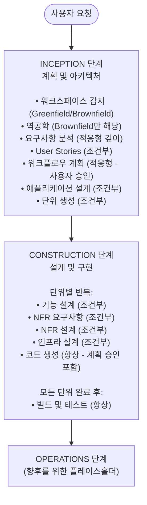

> **이 리포지토리는 [ijin/aidlc-cc-plugin](https://github.com/ijin/aidlc-cc-plugin)의 한국어 번역본입니다.**
> 이해를 돕기 위한 참고용이며, 실제 플러그인 설치 및 사용은 반드시 [업스트림 리포지토리](https://github.com/ijin/aidlc-cc-plugin)를 이용해 주세요.

---

# Claude Code를 위한 AI-DLC 플러그인 (한국어 해설)

AI가 안내하는 구조화되고 적응형인 소프트웨어 개발 방법론입니다.

## 설치

먼저 Claude Code에 마켓플레이스를 추가합니다 (최초 1회만 필요):

```bash
/plugin marketplace add ijin/aidlc-cc-plugin
```

그런 다음 플러그인을 설치합니다:

```bash
/plugin install aidlc@aidlc-cc-plugin
```

## 빠른 시작

새로운 AI-DLC 워크플로우를 시작합니다:

```bash
/aidlc:start Develop a recommendation engine for cross-selling products
```

또는 기존 세션을 재개합니다:

```bash
/aidlc:start
```

Claude는 이전 세션을 자동으로 감지하고 (`aidlc-docs/aidlc-state.md` 를 통해) 중단했던 지점부터 재개할 것을 제안합니다.

## 작동 방식

AI-DLC는 세 단계의 적응형 워크플로우를 통해 안내합니다:



### 주요 원칙

**적응형 워크플로우** — 각 단계는 가치를 더할 때만 실행됩니다. 간단한 변경은 불필요한 계획 단계를 건너뜁니다. 복잡한 프로젝트는 전체 프로세스를 거칩니다.

**사용자 제어** — 작업이 시작되기 전에 실행 계획을 승인합니다. 승인 게이트에서 변경을 요청할 수 있습니다. 세션을 닫은 후 언제든지 재개할 수 있습니다.

**완전한 감사 추적** — 모든 결정, 사용자 입력, 단계 전환이 타임스탬프와 함께 `aidlc-docs/audit.md` 에 기록됩니다.

**채팅 기반 상호작용** — 대화에서 직접 질문에 답변합니다. 파일 편집이 필요하지 않습니다.

## 산출물 관리

AI-DLC는 `aidlc-docs/` 디렉토리에 포괄적인 문서를 생성합니다:

```
<workspace-root>/
├── [애플리케이션 코드]
└── aidlc-docs/
    ├── aidlc-state.md           # 체크박스가 있는 진행 상황 추적
    ├── audit.md                 # 타임스탬프가 있는 완전한 감사 추적
    ├── inception/
    │   ├── workspace-analysis.md
    │   ├── reverse-engineering/  # (Brownfield만 해당)
    │   ├── requirements/
    │   ├── user-stories/         # (실행된 경우)
    │   ├── application-design/   # (실행된 경우)
    │   └── plans/
    ├── construction/
    │   ├── unit-01/
    │   │   ├── functional-design/
    │   │   ├── nfr-requirements/
    │   │   ├── nfr-design/
    │   │   └── infrastructure-design/
    │   └── build-and-test/
    └── operations/               # (플레이스홀더)
```

### aidlc-docs/를 커밋해야 할까요?

**옵션 1: 모두 커밋 (팀 프로젝트에 권장)**
- 팀을 위한 완전한 감사 추적 및 설계 문서
- AI 결정 검토 가능
- 새로운 팀원을 위한 온보딩 컨텍스트 제공

```bash
git add aidlc-docs/
git commit -m "Add AI-DLC artifacts"
```

**옵션 2: Gitignore (개인 프로젝트에 권장)**
- 로컬 작업 노트로 취급
- 리포지토리 크기 감소
- 필요시 재생성

```bash
echo "aidlc-docs/" >> .gitignore
```

**옵션 3: 선택적 커밋**
- 주요 설계 문서 커밋 (`application-design`, `functional-design`)
- 임시 산출물 제외 (`workspace-analysis.md`, `audit.md`)

```bash
# .gitignore에 추가
aidlc-docs/audit.md
aidlc-docs/aidlc-state.md
aidlc-docs/inception/workspace-analysis.md
```

## 예제

### Greenfield 프로젝트
```bash
/aidlc:start Build a REST API for managing customer subscriptions with Stripe integration
```

AI-DLC는 요구사항을 안내하고, 상위 수준 아키텍처를 설계하며, 작업을 단위로 나누고, 코드를 생성합니다.

### Brownfield 개선
```bash
/aidlc:start Add user authentication with OAuth2 to the existing API
```

AI-DLC는 먼저 코드베이스를 분석한 다음, 기존 아키텍처와 통합하도록 워크플로우를 조정합니다.

### 간단한 버그 수정
```bash
/aidlc:start Fix the race condition in the payment processing queue
```

AI-DLC는 불필요한 단계를 건너뛰고 특정 문제에 집중합니다.

## 감사의 말

이 플러그인은 Amazon Q Developer / Kiro CLI를 위해 원래 설계된 [AWS AI-DLC Workflows](https://github.com/aws-samples/aidlc-workflows) 참조 구현을 기반으로 합니다. Claude Code의 플러그인 시스템에 맞게 채팅 기반 상호작용 패턴으로 조정되었습니다.

원래 방법론은 AWS Samples 팀이 개발했습니다.

## 기여하기

기여를 환영합니다! 기여하려면:

1. 리포지토리를 포크합니다
2. 기능 브랜치를 생성합니다 (`git checkout -b feature/amazing-improvement`)
3. 변경 사항을 작성합니다
4. `claude --plugin-dir .` 로 철저히 테스트합니다
5. Pull Request를 제출합니다

DCO나 공식적인 프로세스는 필요하지 않습니다 — 좋은 코드와 명확한 커밋 메시지만 있으면 됩니다.

## 라이선스

이 프로젝트는 MIT-0 라이선스에 따라 라이선스가 부여됩니다 - 자세한 내용은 [LICENSE](LICENSE) 파일을 참조하세요.

MIT-0은 저작자 표시 요구 사항 없이 사용할 수 있는 허용적 라이선스입니다.
