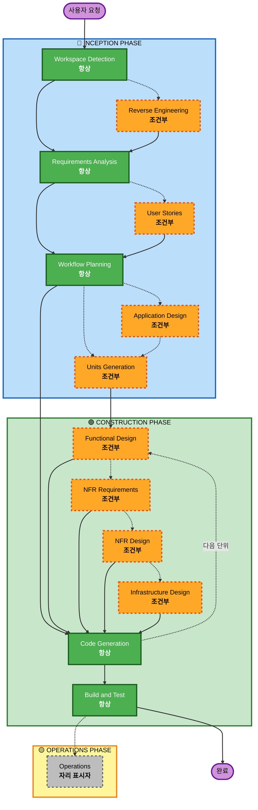

# AI-DLC 적응형 Workflow 개요

**목적**: AI 모델과 개발자가 완전한 workflow 구조를 이해하기 위한 기술 참조.

**참고**: 유사한 콘텐츠가 core-workflow.md (사용자 환영 메시지)와 README.md (문서)에 존재합니다. 이 중복은 의도적입니다 - 각 파일은 다른 목적을 제공합니다:
- **이 파일**: AI 모델 context 로딩을 위한 Mermaid 다이어그램이 있는 상세한 기술 참조
- **core-workflow.md**: ASCII 다이어그램이 있는 사용자 대면 환영 메시지
- **README.md**: 저장소를 위한 사람이 읽을 수 있는 문서

## 3단계 생명 주기:
• **INCEPTION PHASE**: 계획 및 아키텍처 (Workspace Detection + 조건부 단계 + Workflow Planning)
• **CONSTRUCTION PHASE**: 설계, 구현, 빌드 및 테스트 (단위별 설계 + Code Planning/Generation + Build & Test)
• **OPERATIONS PHASE**: 향후 배포 및 모니터링 workflow를 위한 자리 표시자

## 적응형 Workflow:
• **Workspace Detection** (항상) → **Reverse Engineering** (Brownfield만) → **Requirements Analysis** (항상, 적응형 깊이) → **조건부 단계** (필요에 따라) → **Workflow Planning** (항상) → **Code Generation** (항상, 단위별) → **Build and Test** (항상)

## 작동 방식:
• **AI가 분석** 귀하의 요청, workspace 및 복잡성을 분석하여 필요한 단계를 결정합니다
• **이러한 단계는 항상 실행**: Workspace Detection, Requirements Analysis (적응형 깊이), Workflow Planning, Code Generation (단위별), Build and Test
• **다른 모든 단계는 조건부**: Reverse Engineering, User Stories, Application Design, Units Generation, 단위별 설계 단계 (Functional Design, NFR Requirements, NFR Design, Infrastructure Design)
• **고정된 순서 없음**: 단계는 귀하의 특정 작업에 적합한 순서로 실행됩니다

## 팀의 역할:
• **질문에 답변** Claude가 prompt할 때 대화에서 직접
• **"기타" 옵션 사용 가능**: 제공된 옵션이 맞지 않으면 "기타"를 선택하고 맞춤 응답을 설명하세요
• **팀으로 작업** 진행하기 전에 각 단계를 검토하고 승인합니다
• **함께 결정** 필요할 때 아키텍처 접근 방식에 대해
• **중요**: 이것은 팀 노력입니다 - 각 단계에 관련 이해관계자를 참여시키세요

## AI-DLC 3단계 Workflow:

**단계 설명:**

**🔵 INCEPTION PHASE** - 계획 및 아키텍처
- Workspace Detection: workspace 상태 및 프로젝트 유형 분석 (항상)
- Reverse Engineering: 기존 코드베이스 분석 (조건부 - Brownfield만)
- Requirements Analysis: 요구사항 수집 및 검증 (항상 - 적응형 깊이)
- User Stories: user stories 및 personas 생성 (조건부)
- Workflow Planning: 실행 계획 생성 (항상)
- Application Design: 고수준 컴포넌트 식별 및 서비스 레이어 설계 (조건부)
- Units Generation: 작업 단위로 분해 (조건부)

**🟢 CONSTRUCTION PHASE** - 설계, 구현, 빌드 및 테스트
- Functional Design: 단위별 상세 비즈니스 로직 설계 (조건부, 단위별)
- NFR Requirements: NFR 결정 및 기술 스택 선택 (조건부, 단위별)
- NFR Design: NFR 패턴 및 논리 컴포넌트 통합 (조건부, 단위별)
- Infrastructure Design: 실제 인프라 서비스에 매핑 (조건부, 단위별)
- Code Generation: Part 1 - 계획, Part 2 - 생성으로 코드 생성 (항상, 단위별)
- Build and Test: 모든 단위 빌드 및 포괄적 테스트 실행 (항상)

**🟡 OPERATIONS PHASE** - 자리 표시자
- Operations: 향후 배포 및 모니터링 workflow를 위한 자리 표시자 (자리 표시자)

**핵심 원칙:**
- 단계는 가치를 추가할 때만 실행
- 각 단계는 독립적으로 평가
- INCEPTION은 "무엇"과 "왜"에 초점
- CONSTRUCTION은 "어떻게" + "빌드 및 테스트"에 초점
- OPERATIONS는 향후 확장을 위한 자리 표시자
- 간단한 변경은 조건부 INCEPTION 단계를 건너뛸 수 있음
- 복잡한 변경은 전체 INCEPTION 및 CONSTRUCTION 처리를 받음
