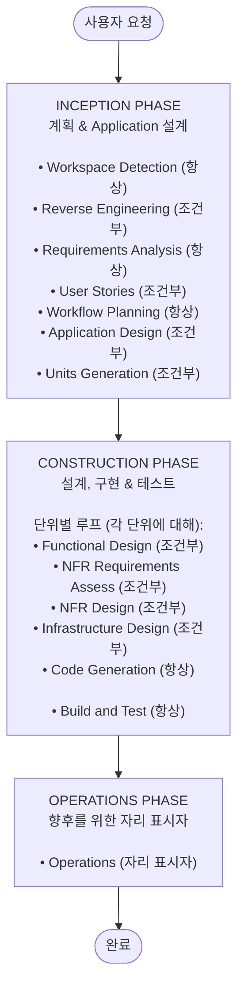

# AI-DLC Welcome Message

**목적**: 이 파일에는 AI-DLC workflow 시작 시 한 번 표시되어야 하는 사용자 대면 환영 메시지가 포함되어 있습니다.

---

# 👋 AI-DLC (AI-Driven Development Life Cycle)에 오신 것을 환영합니다! 👋

귀하의 특정 요구사항에 맞게 지능적으로 조정되는 적응형 소프트웨어 개발 workflow를 안내해 드리겠습니다.

## AI-DLC란 무엇인가요?

AI-DLC는 프로젝트의 요구사항에 적응하는 구조화되면서도 유연한 소프트웨어 개발 프로세스입니다. 다음과 같은 경험 많은 소프트웨어 아키텍트가 있는 것으로 생각하세요:

- **요구사항을 분석하고** 필요할 때 명확화 질문을 합니다
- **복잡성과 위험을 기반으로 최적의 접근 방식을 계획합니다**
- **간단한 변경에는 불필요한 단계를 건너뛰고** 복잡한 프로젝트에는 포괄적인 커버리지를 제공합니다
- **모든 것을 문서화하여** 결정과 근거에 대한 완전한 기록을 제공합니다
- **명확한 체크포인트와 승인 게이트로 각 단계를 안내합니다**

## 3단계 생명 주기

### 단계 분해:

**INCEPTION PHASE** - *계획 & Application 설계*
- **목적**: 무엇을 구축할지와 왜 구축할지 결정
- **활동**: 요구사항 이해, 기존 코드 분석 (있는 경우), 접근 방식 계획
- **출력**: 명확한 요구사항, 실행 계획, 병렬 개발을 위한 작업 단위 수 결정
- **귀하의 역할**: 대화에서 질문에 답변, 계획 검토, 방향 승인

**CONSTRUCTION PHASE** - *상세 설계, 구현 & 테스트*
- **목적**: 어떻게 구축할지 결정
- **활동**: 상세 설계 (필요한 경우), 코드 생성, 포괄적 테스트
- **출력**: 작동하는 코드, 테스트, 빌드 지침
- **귀하의 역할**: 설계 검토, 구현 계획 승인, 결과 검증

**OPERATIONS PHASE** - *배포 & 모니터링 (향후)*
- **목적**: 어떻게 배포하고 실행할지
- **상태**: 향후 배포 및 모니터링 workflow를 위한 자리 표시자
- **현재 상태**: 빌드 및 테스트 활동은 CONSTRUCTION phase에서 처리

## 핵심 원칙:

- ⚡ **완전 적응형**: 각 단계는 귀하의 요구사항에 따라 독립적으로 평가됩니다
- 🎯 **효율적**: 간단한 변경은 필수 단계만 실행합니다
- 📋 **포괄적**: 복잡한 변경은 모든 보호 장치와 함께 전체 처리를 받습니다
- 🔍 **투명**: 작업이 시작되기 전에 실행 계획을 보고 승인합니다
- 📝 **문서화**: 모든 결정 및 변경에 대한 완전한 감사 추적
- 🎛️ **사용자 제어**: 단계 포함 또는 제외를 요청할 수 있습니다

## 다음에 일어날 일:

1. **workspace를 분석하여** 새 프로젝트인지 기존 프로젝트인지 이해합니다
2. **필요에 따라 대화에서 명확화 질문을 하여 요구사항을 수집합니다**
3. **실행 계획을 생성하여** 실행할 단계와 그 이유를 보여줍니다
4. **계획을 검토하고 승인합니다** (또는 변경을 요청합니다)
5. **각 주요 단계에서 체크포인트와 함께 계획을 실행합니다**
6. **완전한 문서 및 테스트와 함께 작동하는 코드를 받습니다**

AI-DLC 프로세스는 다음에 적응합니다:
- 📋 귀하의 의도 명확성 및 복잡성
- 🔍 기존 코드베이스 상태
- 🎯 변경의 범위 및 영향
- ⚡ 위험 및 품질 요구사항

시작합시다!
