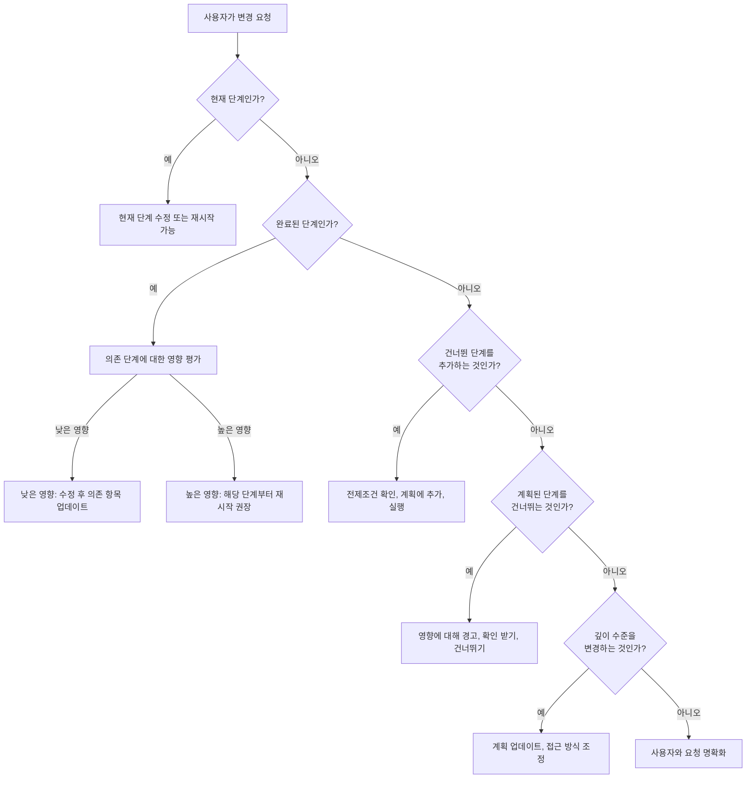

# 워크플로우 중간 변경 및 단계 관리

## 개요

사용자는 워크플로우 중에 실행 계획이나 단계 실행에 대한 변경을 요청할 수 있습니다. 이 문서는 이러한 요청을 안전하고 효과적으로 처리하는 방법에 대한 지침을 제공합니다.

---

## 워크플로우 중간 변경 유형

### 1. 건너뛴 단계 추가

**시나리오**: 사용자가 원래 건너뛴 단계를 추가하려는 경우

**예제**: "Actually, I want to add user stories even though we skipped that stage"

**처리**:
1. **요청 확인**: "You want to add User Stories stage. This will create user stories and personas. Confirm?"
2. **종속성 확인**: 모든 전제 조건 단계가 완료되었는지 확인
3. **실행 계획 업데이트**: 근거와 함께 `execution-plan.md`에 단계 추가
4. **상태 업데이트**: `aidlc-state.md`에서 단계를 "PENDING"으로 표시
5. **단계 실행**: 일반적인 단계 실행 프로세스 따르기
6. **변경 로그**: 타임스탬프와 이유와 함께 `audit.md`에 문서화

**고려사항**:
- 새 아티팩트의 혜택을 받을 수 있는 이후 단계를 업데이트해야 할 수 있음
- 기존 아티팩트는 새 정보를 통합하기 위해 수정이 필요할 수 있음
- 일정이 연장됨

---

### 2. 계획된 단계 건너뛰기

**시나리오**: 사용자가 실행하도록 계획된 단계를 건너뛰려는 경우

**예제**: "Let's skip the NFR Design stage for now"

**처리**:
1. **요청 확인**: "You want to skip NFR Design. This means no NFR patterns or logical components will be incorporated. Confirm?"
2. **영향에 대해 경고**: 무엇이 누락될지와 잠재적인 결과 설명
3. **명시적 확인 받기**: 사용자는 영향에 대한 이해를 명시적으로 확인해야 함
4. **실행 계획 업데이트**: 이유와 함께 단계를 "SKIPPED"로 표시
5. **상태 업데이트**: `aidlc-state.md`에서 단계를 "SKIPPED"로 표시
6. **이후 단계 조정**: 이후 단계에 수동 설정이 필요할 수 있음을 메모
7. **변경 로그**: 타임스탬프와 이유와 함께 `audit.md`에 문서화

**고려사항**:
- 이후 단계가 실패하거나 수동 개입이 필요할 수 있음
- 사용자가 누락된 아티팩트에 대한 책임을 수락
- 필요시 나중에 다시 추가 가능

---

### 3. 현재 스테이지 재시작

**시나리오**: 사용자가 현재 스테이지 결과에 불만족하고 다시 하려는 경우

**예제**: "I don't like these user stories. Can we start over?"

**처리**:
1. **우려 사항 이해**: "What specifically would you like to change about the stories?"
2. **옵션 제공**:
   - **옵션 A**: 기존 아티팩트 수정 (더 빠르고, 일부 작업 보존)
   - **옵션 B**: 완전 재시작 (깨끗한 시작, 더 많은 시간)
3. **재시작 선택 시**:
   - 기존 아티팩트 아카이브: `{artifact}.backup.{timestamp}`
   - 계획 파일에서 스테이지 체크박스 재설정
   - `aidlc-state.md`에서 스테이지를 "IN PROGRESS"로 표시
   - 스테이지 완료 상태 지우기
   - 처음부터 재실행
4. **변경 로그**: 재시작 이유와 변경 사항 문서화

**고려사항**:
- 기존 작업이 손실됨 (하지만 백업됨)
- 종속 스테이지를 다시 해야 할 수 있음
- 일정이 연장됨

---

### 4. 이전 스테이지 재시작

**시나리오**: 사용자가 돌아가서 완료된 스테이지를 다시 하려는 경우

**예제**: "I want to change the architectural decision we made earlier"

**처리**:
1. **영향 평가**: 재시작할 스테이지에 의존하는 모든 스테이지 식별
2. **사용자에게 경고**: "Restarting Application Design will require redoing: Units Planning, Units Generation, per-unit design (all units), Code Planning, Code Generation. Confirm?"
3. **명시적 확인 받기**: 사용자는 전체 영향을 이해해야 함
4. **확인된 경우**:
   - 영향받은 모든 아티팩트 아카이브
   - `aidlc-state.md`에서 영향받은 모든 스테이지 재설정
   - 영향받은 모든 계획 파일에서 체크박스 지우기
   - 재시작할 스테이지로 돌아가기
   - 그 지점부터 재실행
5. **변경 로그**: 전체 영향과 재시작 이유 문서화

**고려사항**:
- 상당한 재작업 필요
- 모든 종속 스테이지를 다시 해야 함
- 일정이 크게 연장됨
- 수정이 재시작보다 나은지 고려

---

### 5. 스테이지 깊이 변경

**시나리오**: 사용자가 현재 또는 향후 스테이지의 깊이 수준을 변경하려는 경우

**예제**: "Let's do a comprehensive requirements analysis instead of standard"

**처리**:
1. **요청 확인**: "You want to change Requirements Analysis from Standard to Comprehensive depth. This will be more thorough but take longer. Confirm?"
2. **실행 계획 업데이트**: `workflow-planning.md`에서 깊이 수준 변경
3. **접근 방식 조정**: 스테이지에 대한 포괄적인 깊이 가이드라인 따르기
4. **예상 업데이트**: 새로운 일정 예상을 사용자에게 알림
5. **변경 로그**: 깊이 변경 및 이유 문서화

**고려사항**:
- 더 많은 깊이 = 더 많은 시간이지만 더 나은 품질
- 더 적은 깊이 = 더 빠르지만 세부 사항을 놓칠 수 있음
- 완료 후가 아닌 스테이지 전 또는 중에만 변경 가능

---

### 6. 워크플로우 일시 중지

**시나리오**: 사용자가 일시 중지하고 나중에 재개해야 하는 경우

**예제**: "I need to stop for now and continue tomorrow"

**처리**:
1. **현재 단계 완료**: 가능하면 진행 중인 현재 단계 완료
2. **체크박스 업데이트**: 완료된 모든 단계를 [x]로 표시
3. **상태 업데이트**: `aidlc-state.md`가 현재 상태를 반영하는지 확인
4. **일시 중지 로그**: `audit.md`에 일시 중지 지점 문서화
5. **재개 지침 제공**: "When you return, I'll detect your existing project and offer to continue from: [current phase, current step]"

**재개 시**:
1. **기존 프로젝트 감지**: `aidlc-state.md` 확인
2. **Context 로드**: 완료된 스테이지의 모든 아티팩트 읽기
3. **상태 표시**: 현재 스테이지 및 다음 단계 표시
4. **옵션 제공**: 중단한 곳에서 계속하거나 이전 작업 검토
5. **재개 로그**: `audit.md`에 재개 지점 문서화

---

### 7. 아키텍처 결정 변경

**시나리오**: 사용자가 모놀리스에서 마이크로서비스로 변경하려는 경우 (또는 그 반대)

**예제**: "Actually, let's do microservices instead of a monolith"

**처리**:
1. **현재 진행 상황 평가**: 워크플로우에서 얼마나 진행되었는지 결정
2. **영향 설명**:
   - Units Planning 전: 최소 영향, 결정만 업데이트
   - Units Planning 후: Units Planning, Units Generation, 모든 per-unit 설계 다시 해야 함
   - Code Generation 후: 상당한 재작업 필요
3. **접근 방식 권장**:
   - 워크플로우 초기: Application Design 스테이지부터 재시작
   - 워크플로우 후기: 수정이 가능한지 vs. 재시작 고려
4. **확인 받기**: 사용자는 변경의 전체 범위를 이해해야 함
5. **변경 실행**: 영향받은 스테이지에 대한 재시작 절차 따르기

**고려사항**:
- 아키텍처 변경은 연쇄 효과가 있음
- 워크플로우 초기 = 변경이 더 쉬움
- 워크플로우 후기 = 비용 vs. 이익 고려

---

### 8. 유닛 추가/제거

**시나리오**: 사용자가 Units Generation 후 유닛을 추가하거나 제거하려는 경우

**예제**: "We need to split the Payment unit into Payment and Billing"

**처리**:
1. **영향 평가**: 어떤 유닛이 설계/코드를 완료했는지 결정
2. **결과 설명**:
   - 유닛 추가: 새 유닛에 대한 전체 설계 및 코드 필요
   - 유닛 제거: 기능을 다른 유닛으로 재분배 필요
   - 유닛 분할: 결과 유닛 모두에 대한 설계 및 코드 다시 해야 함
3. **유닛 아티팩트 업데이트**:
   - `unit-of-work.md` 수정
   - `unit-of-work-dependency.md` 업데이트
   - `unit-of-work-story-map.md` 수정
4. **영향받은 유닛 재설정**: 영향받은 유닛을 재설계 필요로 표시
5. **변경 실행**: 영향받은 유닛에 대한 일반적인 유닛 설계 및 코드 프로세스 따르기

**고려사항**:
- 해당 유닛의 모든 다운스트림 스테이지에 영향
- 종속성이 변경되면 다른 유닛에 영향을 미칠 수 있음
- 일정 영향은 영향받은 유닛 수에 따라 다름

---

## 변경 처리 일반 가이드라인

### 변경하기 전에

1. **요청 이해**: 사용자가 무엇을 변경하고 싶은지, 왜 그런지에 대한 명확화 질문
2. **영향 평가**: 영향받은 모든 스테이지, 아티팩트 및 종속성 식별
3. **결과 설명**: 다시 해야 할 것과 일정 영향을 명확히 전달
4. **대안 제공**: 때때로 수정이 재시작보다 나음
5. **명시적 확인 받기**: 사용자는 영향을 이해하고 수락해야 함

### 변경 중

1. **기존 작업 아카이브**: 파괴적 변경 전에 항상 백업
2. **모든 추적 업데이트**: `aidlc-state.md`, 계획 파일 및 `audit.md`를 동기화 상태로 유지
3. **진행 상황 전달**: 무슨 일이 일어나고 있는지 사용자에게 알림
4. **변경 검증**: 모든 아티팩트에서 변경이 일관성 있는지 확인
5. **연속성 테스트**: 변경 후 워크플로우가 원활하게 계속될 수 있는지 확인

### 변경 후

1. **일관성 확인**: 모든 아티팩트가 변경과 일치하는지 확인
2. **문서 업데이트**: 모든 참조가 업데이트되었는지 확인
3. **완전히 로그**: `audit.md`에 전체 변경 이력 문서화
4. **사용자와 확인**: 변경이 사용자의 기대를 충족하는지 확인
5. **워크플로우 재개**: 새 상태에서 일반적인 실행으로 계속

---

## 변경 요청 의사 결정 트리



---

## 로깅 요구사항

### 변경 요청 로그 형식

```markdown
## Change Request - [Phase Name]
**Timestamp**: [ISO timestamp]
**Request**: [What user wants to change]
**Current State**: [Where we are in workflow]
**Impact Assessment**: [What will be affected]
**User Confirmation**: [User's explicit confirmation]
**Action Taken**: [What was done]
**Artifacts Affected**: [List of files changed/reset]

---
```

---

## 모범 사례

1. **항상 확인**: 명시적인 사용자 확인 없이 파괴적 변경을 절대 하지 마세요
2. **영향 설명**: 사용자는 결정하기 전에 결과를 이해해야 함
3. **옵션 제공**: 때때로 변경을 처리하는 여러 방법이 있음
4. **먼저 아카이브**: 파괴적 변경 전에 항상 백업
5. **모든 것 업데이트**: 모든 추적 파일을 동기화 상태로 유지
6. **철저히 로그**: 감사 추적을 위해 모든 변경 사항 문서화
7. **후에 검증**: 워크플로우가 원활하게 계속될 수 있는지 확인
8. **유연하게**: 워크플로우는 사용자 요구에 적응해야 하며, 엄격한 프로세스를 강요하지 마세요
