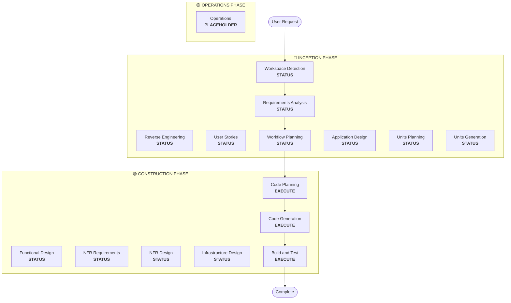

# Workflow Planning

**목적**: 실행할 단계 결정 및 포괄적인 실행 계획 생성

**항상 실행**: 이 단계는 요구사항과 범위를 이해한 후 항상 실행됨

## Step 1: 모든 이전 컨텍스트 로드

### 1.1 Reverse Engineering 아티팩트 로드 (brownfield인 경우)
- architecture.md
- component-inventory.md
- technology-stack.md
- dependencies.md

### 1.2 Requirements Analysis 로드
- requirements.md (의도 분석 포함)
- requirement-verification-questions.md (답변 포함)

### 1.3 User Stories 로드 (실행된 경우)
- stories.md
- personas.md

## Step 2: 상세한 범위 및 영향 분석

**이제 완전한 컨텍스트 (요구사항 + 스토리)를 가지고 상세 분석 수행:**

### 2.1 변환 범위 감지 (Brownfield만)

**Brownfield 프로젝트인 경우**, 변환 범위 분석:

#### 아키텍처 변환
- **단일 컴포넌트 변경** vs **아키텍처 변환**
- **인프라 변경** vs **애플리케이션 변경**
- **배포 모델 변경** (Lambda→Container, EC2→Serverless, 등)

#### 관련 컴포넌트 식별
변환의 경우 다음을 식별:
- **인프라 코드** 업데이트 필요
- **CDK stacks** 변경 필요
- **API Gateway** 구성
- **Load balancer** 요구사항
- **Networking** 필요한 변경
- **Monitoring/logging** 적응

#### 패키지 간 영향
- **CDK infrastructure** 업데이트가 필요한 패키지
- **Shared models** 버전 업데이트 필요
- **Client libraries** 엔드포인트 변경 필요
- **Test packages** 새 테스트 시나리오 필요

### 2.2 변경 영향 평가

#### 영향 영역
1. **사용자 대면 변경**: 사용자 경험에 영향을 미치는가?
2. **구조적 변경**: 시스템 아키텍처를 변경하는가?
3. **데이터 모델 변경**: 데이터베이스 스키마나 데이터 구조에 영향을 미치는가?
4. **API 변경**: 인터페이스나 계약에 영향을 미치는가?
5. **NFR 영향**: 성능, 보안 또는 확장성에 영향을 미치는가?

#### 애플리케이션 레이어 영향 (해당하는 경우)
- **코드 변경**: 새 진입점, 어댑터, 구성
- **의존성**: 새 라이브러리, 프레임워크 변경
- **구성**: 환경 변수, 설정 파일
- **테스트**: 단위 테스트, 통합 테스트

#### 인프라 레이어 영향 (해당하는 경우)
- **배포 모델**: Lambda→ECS, EC2→Fargate, 등
- **Networking**: VPC, 보안 그룹, 로드 밸런서
- **Storage**: 영구 볼륨, 공유 스토리지
- **Scaling**: 자동 확장 정책, 용량 계획

#### 운영 레이어 영향 (해당하는 경우)
- **Monitoring**: CloudWatch, 사용자 정의 메트릭, 대시보드
- **Logging**: 로그 집계, 구조화된 로깅
- **Alerting**: 알람 구성, 알림 채널
- **Deployment**: CI/CD 파이프라인 변경, 롤백 전략

### 2.3 컴포넌트 관계 매핑 (Brownfield만)

**Brownfield 프로젝트인 경우**, 컴포넌트 의존성 그래프 생성:

```markdown
## Component Relationships
- **Primary Component**: [변경 중인 패키지]
- **Infrastructure Components**: [CDK/Terraform 패키지]
- **Shared Components**: [Models, utilities, clients]
- **Dependent Components**: [이 컴포넌트를 호출하는 서비스]
- **Supporting Components**: [Monitoring, logging, deployment]
```

각 관련 컴포넌트에 대해:
- **Change Type**: Major, Minor, Configuration-only
- **Change Reason**: 직접 의존성, 배포 모델, 네트워킹
- **Change Priority**: Critical, Important, Optional

### 2.4 위험 평가

위험 수준 평가:
1. **Low**: 격리된 변경, 쉬운 롤백, 잘 이해됨
2. **Medium**: 여러 컴포넌트, 중간 롤백, 일부 미지수
3. **High**: 시스템 전체 영향, 복잡한 롤백, 상당한 미지수
4. **Critical**: 프로덕션에 중요, 어려운 롤백, 높은 불확실성

## Step 3: 단계 결정

### 3.1 User Stories - 이미 실행됨 또는 건너뛰기?
**이미 실행됨**: 다음 결정으로 이동
**실행되지 않음 - 다음의 경우 실행**:
- 여러 사용자 페르소나
- 사용자 경험 영향
- 수락 기준 필요
- 팀 협업 필요

**다음의 경우 건너뛰기**:
- 내부 리팩토링
- 명확한 재현이 가능한 버그 수정
- 기술 부채 감소
- 인프라 변경

### 3.2 Application Design - 다음의 경우 실행:
- 새 컴포넌트 또는 서비스 필요
- 컴포넌트 메서드 및 비즈니스 규칙 정의 필요
- 서비스 레이어 설계 필요
- 컴포넌트 의존성 명확화 필요

**다음의 경우 건너뛰기**:
- 기존 컴포넌트 경계 내 변경
- 새 컴포넌트나 메서드 없음
- 순수 구현 변경

### 3.3 Design (Units Planning/Generation) - 다음의 경우 실행:
- 새 데이터 모델 또는 스키마
- API 변경 또는 새 엔드포인트
- 복잡한 알고리즘 또는 비즈니스 로직
- 상태 관리 변경
- 여러 패키지 변경 필요
- Infrastructure-as-code 업데이트 필요

**다음의 경우 건너뛰기**:
- 단순 로직 변경
- UI만 변경
- 구성 업데이트
- 직관적인 구현

### 3.4 NFR Implementation - 다음의 경우 실행:
- 성능 요구사항
- 보안 고려사항
- 확장성 우려
- 모니터링/관찰 가능성 필요

**다음의 경우 건너뛰기**:
- 기존 NFR 설정이 충분함
- 새 NFR 요구사항 없음
- NFR 영향이 없는 단순 변경

## Step 4: 적응형 세부 사항 참고

**적응형 깊이 설명은 [depth-levels.md](../common/depth-levels.md) 참조**

실행될 각 단계에 대해:
- 정의된 모든 아티팩트가 생성됨
- 아티팩트 내 세부 수준은 문제 복잡도에 따라 조정됨
- 모델이 문제 특성에 따라 적절한 세부 사항 결정

## Step 5: 다중 모듈 조정 분석 (Brownfield만)

**여러 모듈/패키지가 있는 Brownfield인 경우**, 의존성을 분석하고 최적의 업데이트 전략 결정:

### 5.1 모듈 의존성 분석
- 빌드 시스템 의존성 및 의존성 매니페스트 검토
- 빌드 타임 vs 런타임 의존성 식별
- 모듈 간 API 계약 및 공유 인터페이스 매핑

### 5.2 업데이트 전략 결정
의존성 분석을 기반으로 결정:
- **업데이트 순서**: 의존성으로 인해 먼저 업데이트해야 하는 모듈
- **병렬화 기회**: 동시에 업데이트할 수 있는 모듈
- **조정 요구사항**: 버전 호환성, API 계약, 배포 순서
- **테스트 전략**: 모듈별 vs 통합 테스트 접근법
- **롤백 전략**: 중간 순서 실패 시 복구 계획

### 5.3 조정 계획 문서화
```markdown
## Module Update Strategy
- **Update Approach**: [Sequential/Parallel/Hybrid]
- **Critical Path**: [다른 업데이트를 차단하는 모듈]
- **Coordination Points**: [공유 APIs, infrastructure, data contracts]
- **Testing Checkpoints**: [통합 검증 시기]
```

영향을 받는 각 모듈에 대해 식별:
- **Update priority**: 먼저 업데이트해야 함 vs 나중에 업데이트 가능
- **Dependency constraints**: 무엇에 의존하는지, 무엇이 이것에 의존하는지
- **Change scope**: Major (breaking), Minor (compatible), Patch (fixes)

## Step 6: 워크플로 시각화 생성

다음을 보여주는 Mermaid 플로우차트 생성:
- 순서대로 모든 단계
- 각 조건부 단계에 대한 EXECUTE 또는 SKIP 결정
- 각 단계 상태에 대한 적절한 스타일링

**스타일링 규칙** (플로우차트 뒤에 추가):
```
style WD fill:#4CAF50,stroke:#1B5E20,stroke-width:3px,color:#fff
style CP fill:#4CAF50,stroke:#1B5E20,stroke-width:3px,color:#fff
style CG fill:#4CAF50,stroke:#1B5E20,stroke-width:3px,color:#fff
style BT fill:#4CAF50,stroke:#1B5E20,stroke-width:3px,color:#fff
style US fill:#BDBDBD,stroke:#424242,stroke-width:2px,stroke-dasharray: 5 5,color:#000
style Start fill:#CE93D8,stroke:#6A1B9A,stroke-width:3px,color:#000
style End fill:#CE93D8,stroke:#6A1B9A,stroke-width:3px,color:#000

linkStyle default stroke:#333,stroke-width:2px
```

**스타일 가이드라인**:
- 완료됨/항상 실행: `fill:#4CAF50,stroke:#1B5E20,stroke-width:3px,color:#fff` (흰색 텍스트가 있는 Material Green)
- 조건부 EXECUTE: `fill:#FFA726,stroke:#E65100,stroke-width:3px,stroke-dasharray: 5 5,color:#000` (검은색 텍스트가 있는 Material Orange)
- 조건부 SKIP: `fill:#BDBDBD,stroke:#424242,stroke-width:2px,stroke-dasharray: 5 5,color:#000` (검은색 텍스트가 있는 Material Gray)
- Start/End: `fill:#CE93D8,stroke:#6A1B9A,stroke-width:3px,color:#000` (검은색 텍스트가 있는 Material Purple)
- 단계 컨테이너: 밝은 Material 색상 사용 (INCEPTION: #BBDEFB, CONSTRUCTION: #C8E6C9, OPERATIONS: #FFF59D)

## Step 7: 실행 계획 문서 생성

`aidlc-docs/inception/plans/execution-plan.md` 생성:

```markdown
# Execution Plan

## Detailed Analysis Summary

### Transformation Scope (Brownfield만)
- **Transformation Type**: [단일 컴포넌트/아키텍처/인프라]
- **Primary Changes**: [설명]
- **Related Components**: [나열]

### Change Impact Assessment
- **사용자 대면 변경**: [Yes/No - 설명]
- **구조적 변경**: [Yes/No - 설명]
- **데이터 모델 변경**: [Yes/No - 설명]
- **API 변경**: [Yes/No - 설명]
- **NFR 영향**: [Yes/No - 설명]

### Component Relationships (Brownfield만)
[컴포넌트 의존성 그래프]

### Risk Assessment
- **Risk Level**: [Low/Medium/High/Critical]
- **Rollback Complexity**: [Easy/Moderate/Difficult]
- **Testing Complexity**: [Simple/Moderate/Complex]

## Workflow Visualization



**참고**: STATUS 플레이스홀더를 실제 단계 상태 (COMPLETED/SKIP/EXECUTE)로 교체하고 적절한 스타일링 적용

## Phases to Execute

### 🔵 INCEPTION PHASE
- [x] Workspace Detection (COMPLETED)
- [x] Reverse Engineering (COMPLETED/SKIPPED)
- [x] Requirements Elaboration (COMPLETED)
- [x] User Stories (COMPLETED/SKIPPED)
- [x] Execution Plan (IN PROGRESS)
- [ ] Application Design - [EXECUTE/SKIP]
  - **Rationale**: [실행 또는 건너뛰는 이유]
- [ ] Units Planning - [EXECUTE/SKIP]
  - **Rationale**: [실행 또는 건너뛰는 이유]
- [ ] Units Generation - [EXECUTE/SKIP]
  - **Rationale**: [실행 또는 건너뛰는 이유]

### 🟢 CONSTRUCTION PHASE
- [ ] Functional Design - [EXECUTE/SKIP]
  - **Rationale**: [실행 또는 건너뛰는 이유]
- [ ] NFR Requirements - [EXECUTE/SKIP]
  - **Rationale**: [실행 또는 건너뛰는 이유]
- [ ] NFR Design - [EXECUTE/SKIP]
  - **Rationale**: [실행 또는 건너뛰는 이유]
- [ ] Infrastructure Design - [EXECUTE/SKIP]
  - **Rationale**: [실행 또는 건너뛰는 이유]
- [ ] Code Planning - EXECUTE (항상)
  - **Rationale**: 구현 접근법 필요
- [ ] Code Generation - EXECUTE (항상)
  - **Rationale**: 코드 구현 필요
- [ ] Build and Test - EXECUTE (항상)
  - **Rationale**: 빌드, 테스트 및 검증 필요

### 🟡 OPERATIONS PHASE
- [ ] Operations - PLACEHOLDER
  - **Rationale**: 향후 배포 및 모니터링 워크플로

## Package Change Sequence (Brownfield만)
[해당하는 경우, 의존성이 있는 패키지 업데이트 순서 나열]

## Estimated Timeline
- **Total Phases**: [개수]
- **Estimated Duration**: [시간 추정]

## Success Criteria
- **Primary Goal**: [주요 목표]
- **Key Deliverables**: [나열]
- **Quality Gates**: [나열]

[Brownfield인 경우]
- **Integration Testing**: 모든 컴포넌트가 함께 작동
- **Operational Readiness**: 모니터링, 로깅, 알림이 작동
```

## Step 8: 상태 추적 초기화

`aidlc-docs/aidlc-state.md` 업데이트:

```markdown
# AI-DLC State Tracking

## Project Information
- **Project Type**: [Greenfield/Brownfield]
- **Start Date**: [ISO timestamp]
- **Current Stage**: INCEPTION - Workflow Planning

## Execution Plan Summary
- **Total Stages**: [개수]
- **Stages to Execute**: [나열]
- **Stages to Skip**: [이유와 함께 나열]

## Stage Progress

### 🔵 INCEPTION PHASE
- [x] Workspace Detection
- [x] Reverse Engineering (해당하는 경우)
- [x] Requirements Analysis
- [x] User Stories (해당하는 경우)
- [x] Workflow Planning
- [ ] Application Design - [EXECUTE/SKIP]
- [ ] Units Planning - [EXECUTE/SKIP]
- [ ] Units Generation - [EXECUTE/SKIP]

### 🟢 CONSTRUCTION PHASE
- [ ] Functional Design - [EXECUTE/SKIP]
- [ ] NFR Requirements - [EXECUTE/SKIP]
- [ ] NFR Design - [EXECUTE/SKIP]
- [ ] Infrastructure Design - [EXECUTE/SKIP]
- [ ] Code Planning - EXECUTE
- [ ] Code Generation - EXECUTE
- [ ] Build and Test - EXECUTE

### 🟡 OPERATIONS PHASE
- [ ] Operations - PLACEHOLDER

## Current Status
- **Lifecycle Phase**: INCEPTION
- **Current Stage**: Workflow Planning Complete
- **Next Stage**: [실행할 다음 단계]
- **Status**: 진행 준비
```

## Step 9: 사용자에게 계획 제시

```markdown
# 📋 Workflow Planning Complete

다음을 기반으로 포괄적인 실행 계획을 생성했습니다:
- 귀하의 요청: [요약]
- 기존 시스템: [brownfield인 경우 요약]
- 요구사항: [실행된 경우 요약]
- User stories: [실행된 경우 요약]

**상세 분석**:
- 위험 수준: [수준]
- 영향: [주요 영향 요약]
- 영향을 받는 컴포넌트: [나열]

**권장 실행 계획**:

[X]개의 단계를 실행할 것을 권장합니다:

🔵 **INCEPTION PHASE:**
1. [단계 이름] - *근거:* [실행 이유]
2. [단계 이름] - *근거:* [실행 이유]
...

🟢 **CONSTRUCTION PHASE:**
3. [단계 이름] - *근거:* [실행 이유]
4. [단계 이름] - *근거:* [실행 이유]
...

[Y]개의 단계를 건너뛸 것을 권장합니다:

🔵 **INCEPTION PHASE:**
1. [단계 이름] - *근거:* [건너뛰는 이유]
2. [단계 이름] - *근거:* [건너뛰는 이유]
...

🟢 **CONSTRUCTION PHASE:**
3. [단계 이름] - *근거:* [건너뛰는 이유]
4. [단계 이름] - *근거:* [건너뛰는 이유]
...

[여러 패키지가 있는 Brownfield인 경우]
**권장 패키지 업데이트 순서**:
1. [패키지] - [이유]
2. [패키지] - [이유]
...

**예상 일정**: [기간]

> **📋 <u>검토 필요:</u>**
> 실행 계획을 확인해 주세요: `aidlc-docs/inception/plans/execution-plan.md`

> **🚀 <u>다음 단계는?</u>**
>
> **선택 가능:**
>
> 🔧 **변경 요청** - 필요시 실행 계획에 대한 수정 요청
> [단계가 건너뛰어진 경우:]
> 📝 **건너뛴 단계 추가** - 현재 SKIP으로 표시된 단계를 포함하도록 선택
> ✅ **승인 및 계속** - 계획 승인 후 **[다음 단계 이름]** 으로 진행
```

## Step 10: 사용자 응답 처리

- **승인된 경우**: 실행 계획의 다음 단계로 진행
- **변경이 요청된 경우**: 실행 계획 업데이트 및 재확인
- **사용자가 단계를 강제로 포함/제외하려는 경우**: 그에 따라 계획 업데이트

## Step 11: 상호작용 기록

`aidlc-docs/audit.md`에 기록:

```markdown
## Workflow Planning - Approval
**Timestamp**: [ISO timestamp]
**AI Prompt**: "Ready to proceed with this plan?"
**User Response**: "[사용자의 완전한 원본 응답]"
**Status**: [Approved/Changes Requested]
**Context**: [X]개의 단계를 실행하는 워크플로 계획 생성

---
```
